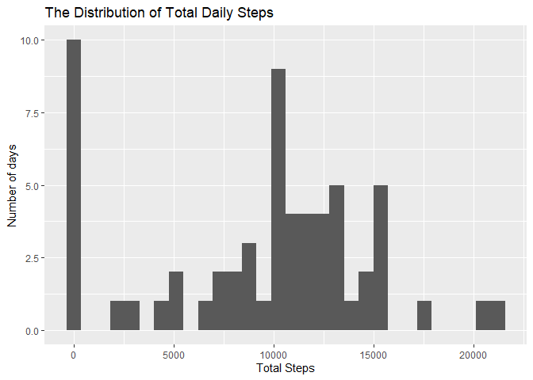
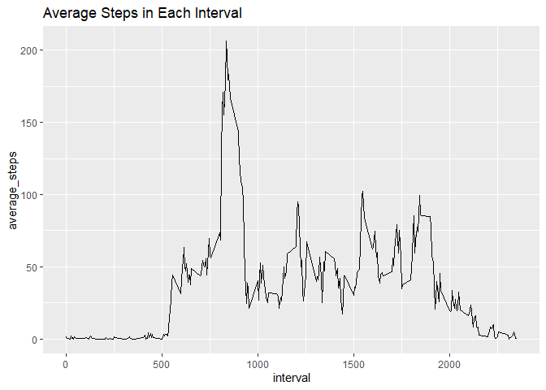
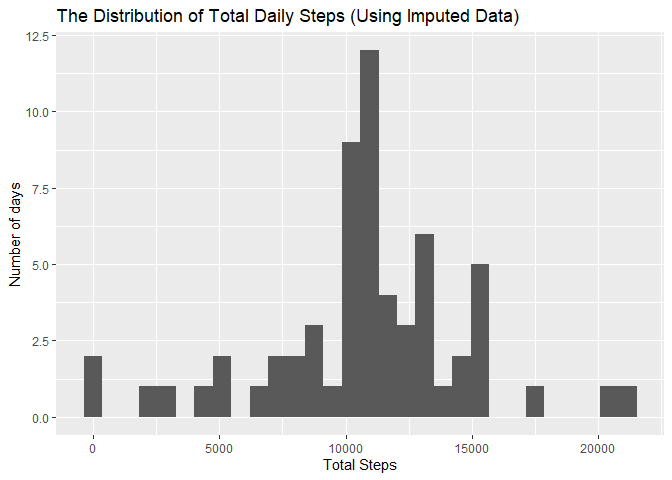
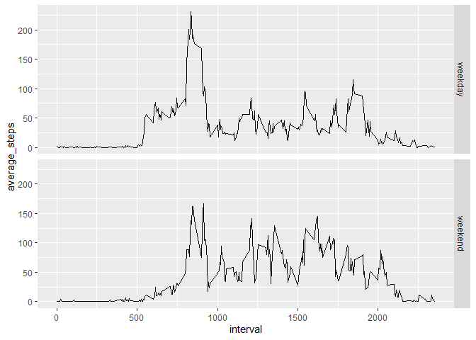

## Loading and preprocessing the data

```r
#Load Libraries
library(dplyr)
```

```
## 
## Attaching package: 'dplyr'
```

```
## The following objects are masked from 'package:stats':
## 
##     filter, lag
```

```
## The following objects are masked from 'package:base':
## 
##     intersect, setdiff, setequal, union
```

```r
library(ggplot2)
library(lubridate)
```

```
## 
## Attaching package: 'lubridate'
```

```
## The following objects are masked from 'package:base':
## 
##     date, intersect, setdiff, union
```

```r
#Requires activity.csv extracted to same wd as script
activity <- read.csv(file = "./activity.csv", header = TRUE)
```

## What is mean total number of steps taken per day?

```r
dailysteps <- group_by(activity, date) %>% 
                select(date, steps) %>% 
                summarise_at(vars(steps), list(total = sum), na.rm = TRUE)
qplot(total, data = dailysteps, main = "The Distribution of Total Daily Steps",
      xlab = "Total Steps", ylab = "Number of days")
```

```
## `stat_bin()` using `bins = 30`. Pick better value with `binwidth`.
```

<!-- -->

```r
print(paste("mean:", as.character(mean(dailysteps$total))))
```

```
## [1] "mean: 9354.22950819672"
```

```r
print(paste("median:", as.character(median(dailysteps$total))))
```

```
## [1] "median: 10395"
```


## What is the average daily activity pattern?

```r
intervalsteps <- group_by(activity, interval) %>% 
                select(interval, steps) %>% 
                summarise_at(vars(steps), list(average_steps = mean), na.rm = TRUE)
qplot(interval, average_steps, data = intervalsteps, geom = "line",
     main = "Average Steps in Each Interval")
```

<!-- -->

```r
max_interval = intervalsteps$interval[which.max(intervalsteps$average_steps)]
print(paste("The interval with the highest average steps is:", max_interval))
```

```
## [1] "The interval with the highest average steps is: 835"
```


## Imputing missing values

```r
#Number of missing values
sum(is.na(activity$steps))
```

```
## [1] 2304
```

```r
#Since interval seems to make a larger difference than day, we'll fill in NA's with the interval mean, fullactivity will be the complete data
fullactivity <- activity
for (i in 1:nrow(fullactivity)) {
        if (is.na(fullactivity$steps[i])) {
                fullactivity$steps[i] <- intervalsteps$average_steps[
                        intervalsteps$interval == fullactivity$interval[i]
                        ]
        }
}
sum(is.na(fullactivity$steps))
```

```
## [1] 0
```

```r
fulldailysteps <- group_by(fullactivity, date) %>% 
                select(date, steps) %>% 
                summarise_at(vars(steps), list(total = sum), na.rm = TRUE)
qplot(total, data = fulldailysteps,
      main = "The Distribution of Total Daily Steps (Using Imputed Data)",
      xlab = "Total Steps", ylab = "Number of days")
```

```
## `stat_bin()` using `bins = 30`. Pick better value with `binwidth`.
```

<!-- -->

```r
print(paste("mean:", as.character(mean(fulldailysteps$total))))
```

```
## [1] "mean: 10766.1886792453"
```

```r
print(paste("median:", as.character(median(fulldailysteps$total))))
```

```
## [1] "median: 10766.1886792453"
```

```r
#We can see that this imputation causes the median and mean to be equal.
```


## Are there differences in activity patterns between weekdays and weekends?

```r
fullactivity <- mutate(fullactivity, daytype = ifelse(wday(date) %in% c(1, 7), "weekend", "weekday"))

daytypesteps <- group_by(fullactivity, interval, daytype) %>% 
                select(interval, daytype, steps) %>% 
                summarise_at(vars(steps), list(average_steps = mean), na.rm = TRUE)
qplot(interval, average_steps, data = daytypesteps, facets = daytype~., geom = "line")
```

<!-- -->
